<br/>
<br/>
<p align="center">
  
  <p align="center">Ensures the correctness of your CODEOWNERS file.</p>
</p>
<br/>
<br/>
<br/>
<br/>

## Codeowners Validator
<a href="https://twitter.com/m_szostok"></a>

<a href="/LICENSE"></a>
<a href="https://goreportcard.com/report/github.com/mszostok/codeowners-validator"></a>
<a href="https://travis-ci.com/github/mszostok/codeowners-validator"></a>

The Codeowners Validator project validates the GitHub [CODEOWNERS](https://help.github.com/articles/about-code-owners/) file based on [specified checks](#checks). It supports public and private GitHub repositories and also GitHub Enterprise installations.



## Usage

#### Docker

```bash
export GH_TOKEN=<your_token>
docker run --rm -v $(pwd):/repo -w /repo \
  -e REPOSITORY_PATH="." \
  -e GITHUB_ACCESS_TOKEN="$GH_TOKEN" \
  -e EXPERIMENTAL_CHECKS="notowned" \
  -e OWNER_CHECKER_REPOSITORY="org-name/rep-name" \
  mszostok/codeowners-validator:v0.6.0
```

#### Command line

```bash
export GH_TOKEN=<your_token>
env REPOSITORY_PATH="." \
    GITHUB_ACCESS_TOKEN="$GH_TOKEN" \
    EXPERIMENTAL_CHECKS="notowned" \
    OWNER_CHECKER_REPOSITORY="org-name/rep-name" \
  codeowners-validator
```

#### GitHub Action

```yaml
- uses: mszostok/codeowners-validator@v0.6.0
  with:
    checks: "files,owners,duppatterns"
    experimental_checks: "notowned"
    # GitHub access token is required only if the `owners` check is enabled
    github_access_token: "${{ secrets.OWNERS_VALIDATOR_GITHUB_SECRET }}"
```

Check [this](./docs/gh-action.md) document for more information about GitHub Action.

----

Check the [Configuration](#configuration) section for more info on how to enable and configure given checks.

## Installation

It's highly recommended to install a fixed version of `codeowners-validator`. Releases are available on the [releases page](https://github.com/mszostok/codeowners-validator/releases).

#### From Release

Here is the recommended way to install `codeowners-validator`:

```bash
# binary installed into ./bin/
curl -sfL https://raw.githubusercontent.com/mszostok/codeowners-validator/master/install.sh | sh -s v0.6.0

# binary installed into $(go env GOPATH)/bin/codeowners-validator
curl -sfL https://raw.githubusercontent.com/mszostok/codeowners-validator/master/install.sh | sh -s -- -b $(go env GOPATH)/bin v0.6.0

# In alpine linux (as it does not come with curl by default)
wget -O - -q https://raw.githubusercontent.com/mszostok/codeowners-validator/master/install.sh | sh -s v0.6.0

# Print version. Add `--short` to print just the version number.
codeowners-validator -v
```

You can also download [latest version](https://github.com/mszostok/codeowners-validator/releases/latest) from release page manually.

#### From Sources

You can install `codeowners-validator` with `go install github.com/mszostok/codeowners-validator@v0.6.0`.

> NOTE: please use Go 1.16 or greater.

This will put `codeowners-validator` in `$(go env GOPATH)/bin`.

## Checks

The following checks are enabled by default:

| Name       | Description                                                                                                                                                                                                                                                                                                                                                                                                                                                                                                                                                                                                                   |
|------------|-------------------------------------------------------------------------------------------------------------------------------------------------------------------------------------------------------------------------------------------------------------------------------------------------------------------------------------------------------------------------------------------------------------------------------------------------------------------------------------------------------------------------------------------------------------------------------------------------------------------------------|
| duppatterns | **[Duplicated Pattern Checker]** <br /><br /> Reports if CODEOWNERS file contain duplicated lines with the same file pattern.                                                                                                                                                                                                                                                                                                                                                                                                                                                                                                 |
| files      | **[File Exist Checker]** <br /><br /> Reports if CODEOWNERS file contain lines with the file pattern that do not exist in a given repository.                                                                                                                                                                                                                                                                                                                                                                                                                                                                                 |
| owners     | **[Valid Owner Checker]** <br /><br /> Reports if CODEOWNERS file contain invalid owners definition. Allowed owner syntax: `@username`, `@org/team-name` or `user@example.com` <br /> _source: https://help.github.com/articles/about-code-owners/#codeowners-syntax_. <br /> <br /> **Checks:** <br /> &#x09; &nbsp;&nbsp;&nbsp;&nbsp;1. Check if the owner's definition is valid (is either a GitHub user name, an organization team name or an email address). <br /><br />&nbsp;&nbsp;&nbsp;&nbsp;2. Check if a GitHub owner has a GitHub account <br /><br />&nbsp;&nbsp;&nbsp;&nbsp;3. Check if a GitHub owner is in a given organization <br /> <br />&nbsp;&nbsp;&nbsp;&nbsp;4. Check if an organization team exists |
| syntax     | **[Valid Syntax Checker]** <br /><br /> Reports if CODEOWNERS file contain invalid syntax definition. It is imported as: <br />&nbsp;&nbsp;&nbsp;&nbsp;"If any line in your CODEOWNERS file contains invalid syntax, the file will not be detected<br />&nbsp;&nbsp;&nbsp;&nbsp;and will not be used to request reviews. Invalid syntax includes inline comments <br />&nbsp;&nbsp;&nbsp;&nbsp;and user or team names that do not exist on GitHub." <br /> <br /> _source: https://help.github.com/articles/about-code-owners/#codeowners-syntax_. |

The experimental checks are disabled by default:

| Name     | Description                                                                                                                                 |
|----------|---------------------------------------------------------------------------------------------------------------------------------------------|
| notowned | **[Not Owned File Checker]** <br /><br /> Reports if a given repository contain files that do not have specified owners in CODEOWNERS file. |

To enable experimental check set `EXPERIMENTAL_CHECKS=notowned` environment variable. 

Check the [Configuration](#configuration) section for more info on how to enable and configure given checks.

## Configuration

Use the following environment variables to configure the application:

| Name | Default | Description |
|-----|:--------|:------------|
| <tt>REPOSITORY_PATH</tt> <b>*</b> | | Path to your repository on your local machine. |
| <tt>GITHUB_ACCESS_TOKEN</tt>| | GitHub access token. Instruction for creating a token can be found [here](./docs/gh-token.md). If not provided, the owners validating functionality may not work properly. For example, you may reach the API calls quota or, if you are setting GitHub Enterprise base URL, an unauthorized error may occur. |
| <tt>GITHUB_BASE_URL</tt>| https://api.github.com/ | GitHub base URL for API requests. Defaults to the public GitHub API but can be set to a domain endpoint to use with GitHub Enterprise. |
| <tt>GITHUB_UPLOAD_URL</tt> | https://uploads.github.com/ | GitHub upload URL for uploading files. <br> <br>It is taken into account only when `GITHUB_BASE_URL` is also set. If only `GITHUB_BASE_URL` is provided, this parameter defaults to the `GITHUB_BASE_URL` value. |
| <tt>CHECKS</tt>| - |  List of checks to be executed. By default, all checks are executed. Possible values: `files`,`owners`,`duppatterns`,`syntax`. |
| <tt>EXPERIMENTAL_CHECKS</tt> | - | The comma-separated list of experimental checks that should be executed. By default, all experimental checks are turned off. Possible values: `notowned`.|
| <tt>CHECK_FAILURE_LEVEL</tt> | `warning` | Defines the level on which the application should treat check issues as failures. Defaults to `warning`, which treats both errors and warnings as failures, and exits with error code 3. Possible values are `error` and `warning`. |
| <tt>OWNER_CHECKER_REPOSITORY</tt>  <b>*</b>| | The owner and repository name separated by slash. For example, gh-codeowners/codeowners-samples. Used to check if GitHub owner is in the given organization. |
| <tt>OWNER_CHECKER_IGNORED_OWNERS</tt> | `@ghost`| The comma-separated list of owners that should not be validated. Example: `"@owner1,@owner2,@org/team1,example@email.com"`. |
| <tt>NOT_OWNED_CHECKER_SKIP_PATTERNS</tt>| - | The comma-separated list of patterns that should be ignored by `not-owned-checker`. For example, you can specify `*` and as a result, the `*` pattern from the **CODEOWNERS** file will be ignored and files owned by this pattern will be reported as unowned unless a later specific pattern will match that path. It's useful because often we have default owners entry at the begging of the CODOEWNERS file, e.g. `*       @global-owner1 @global-owner2` |

 <b>*</b> - Required

#### Exit status codes

Application exits with different status codes which allow you to easily distinguish between error categories.  

| Code | Description |
|:-----:|:------------|
| **1** | The application startup failed due to the wrong configuration or internal error. |
| **2** | The application was closed because the OS sends a termination signal (SIGINT or SIGTERM). |
| **3** | The CODEOWNERS validation failed - executed checks found some issues. |

## Contributing

Contributions are greatly appreciated! The project follows the typical GitHub pull request model. See [CONTRIBUTING.md](CONTRIBUTING.md) for more details.  

## Roadmap

The [codeowners-validator roadmap uses Github milestones](https://github.com/mszostok/codeowners-validator/milestone/1) to track the progress of the project.

They are sorted with priority. First are most important.
