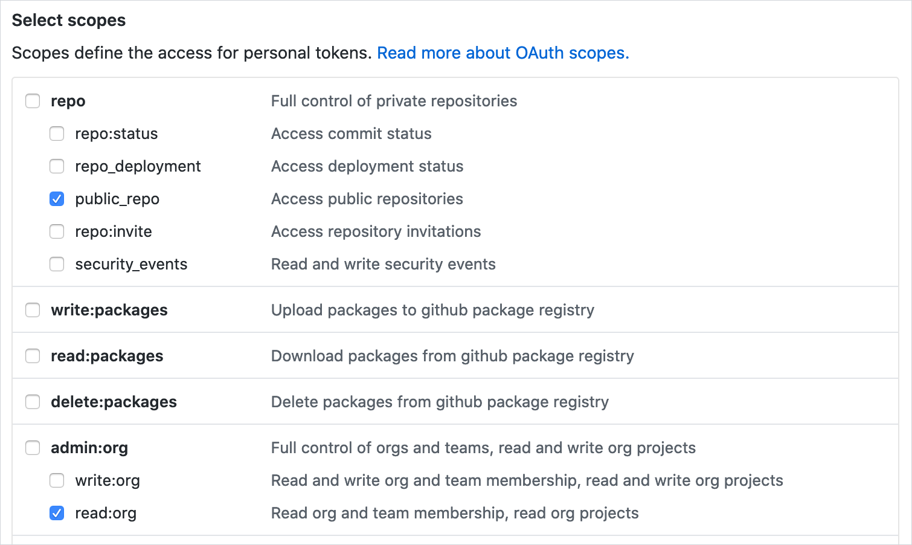
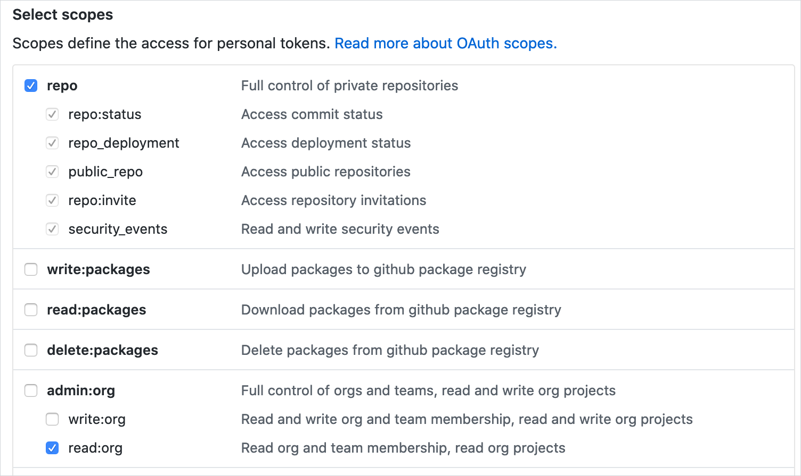

[← back to docs](./README.md)

# GitHub tokens

The [valid_owner.go](./../internal/check/valid_owner.go) check requires the GitHub token for the following reasons:

1. Information about organization teams and their repositories is not publicly available.
2. If you set GitHub Enterprise base URL, an unauthorized error may occur.
3. For unauthenticated requests, the rate limit allows for up to 60 requests per hour. Unauthenticated requests are associated with the originating IP address. In a big organization where you have a lot of calls between your infrastructure server and the GitHub site, it is easy to exceed that quota.

The Codeowners Validator source code is available on GitHub. You can always perform a security audit against its code base and build your own version from the source code if your organization is stricter about the software run in its infrastructure.

You can either use a [personal access token](#github-personal-access-token) or a [GitHub App](#github-app).

## GitHub personal access token

Instructions for creating a token can be found [here](https://help.github.com/articles/creating-a-personal-access-token-for-the-command-line/#creating-a-token). The minimal scope required for the token is **read-only**, but the definition of this scope differs between public and private repositories.

#### Public repositories

For public repositories, select `public_repo` and `read:org`:



#### Private repositories

For private repositories, select `repo` and `read:org`:




## GitHub App

Here are the steps to create a GitHub App and use it for this tool:

1. [Create a GitHub App](https://docs.github.com/en/developers/apps/building-github-apps/creating-a-github-app).
    > **Note**
    > Your app does not need a callback or a webhook URL.
2. Add a read-only permission to the "Members" item of organization permissions.
3. [Install the app in your organization](https://docs.github.com/en/developers/apps/managing-github-apps/installing-github-apps).
4. Done! To authenticate with your app, you need:

    | Name                       | Description                                                                                                                                                                                                                                       |
    |---------------------------------------------------------------------------------------------------------------------------------------------------------------------------------------------------------------------------------------------------|-------------------------------------------------------------------------------------------------------------------------------------------------------------------------------------------------------------------------------------------------|
    | GitHub App Private Key     | PEM-format key generated when the app is installed. If you lost it, you can regenerate it ([docs](https://docs.github.com/en/developers/apps/building-github-apps/authenticating-with-github-apps#generating-a-private-key)).                     |
    | GitHub App ID              | Found in the app's "About" page (Organization settings -> Developer settings -> Edit button on your app).                                                                                                                                         |
    | GitHub App Installation ID | Found in the URL your organization's app install page (Organization settings -> Github Apps -> Configure button on your app). It's the last number in the URL, ex: `https://github.com/organizations/{my-org}/settings/installations/1234567890`. |

6. Depends on the usage you need to:

   1. **CLI:** Export them as environment variable:
      - `GITHUB_APP_INSTALLATION_ID`
      - `GITHUB_APP_ID`
      - `GITHUB_APP_PRIVATE_KEY`

   2. [**GitHub Action:**](gh-action.md) Define them as GitHub secrets and use under the `with` property:

      ```yaml
      - name: GitHub CODEOWNERS Validator
        uses: mszostok/codeowners-validator@v0.7.4
        with:
          # ...
          github_app_id: ${{ secrets.APP_ID }}
          github_app_installation_id: ${{ secrets.APP_INSTALLATION_ID }}
          github_app_private_key: ${{ secrets.APP_PRIVATE_KEY }}
      ```
