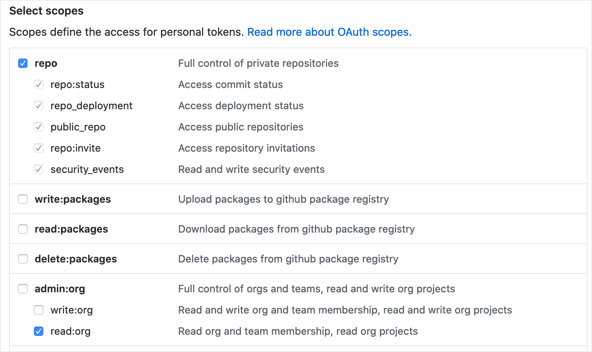

[← back to docs](./README.md)

# GitHub personal access token

The [valid_owner.go](./../internal/check/valid_owner.go) check requires the GitHub personal access token because of those reasons:

1. Information about organization teams and their repositories are not publicly available.
2. If you are setting GitHub Enterprise base URL then an unauthorized error can occur. 
3. For unauthenticated requests, the rate limit allows for up to 60 requests per hour. Unauthenticated requests are associated with the originating IP address. In a big organization where you have a lot of calls between your infrastructure server and GitHub site, it is easy to exceed that quota. 

Instruction for creating a token can be found [here](https://help.github.com/articles/creating-a-personal-access-token-for-the-command-line/#creating-a-token). The token only need to have the read-only scopes but the scope differs between public and private repositories.

#### For the public repositories you should select `public_repo` and `read:org`:

 

#### For the private repositories you should select `repo` and `read:org`:

 

The Codeowners Validator source code is available on the GitHub. You can always perform a security audit against that code base and build your own version from the source code if your organization is more strict about the running software in infrastructure.
